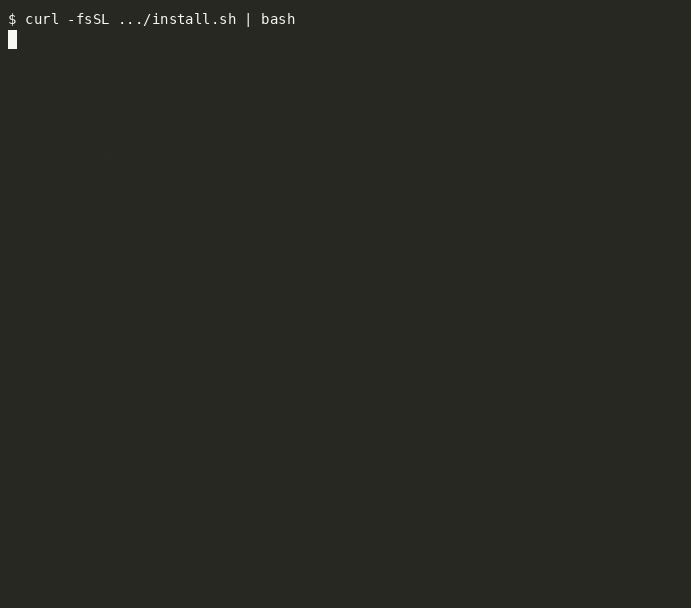

# harness

Single-command bootstrap for AI coding tools. One repo, one install, full environment reproducible on any linux machine in under 30 seconds.




## Numbers

| Metric | Count |
|--------|-------|
| Config templates | 80 |
| Managed files deployed | 52 |
| Hooks (Claude Code) | 23 |
| Skills (shared) | 19 |
| Plugins (Claude Code) | 15 |
| MCP servers | 5 |
| Modules | 8 |
| Template variables | 5 |
| No-op redeploy | <2s |

## Install

```bash
curl -fsSL https://raw.githubusercontent.com/anyesh/harness/main/install.sh | bash
```

First run clones the repo to `~/.harness`, detects installed tools, and deploys everything. Subsequent runs are idempotent (checksum-based skip).

## What gets deployed

### Claude Code

```
~/.claude/settings.json        ← permissions, hooks config, enabledMcpjsonServers
~/.claude/.mcp.json            ← MCP server definitions (cognitive-cache, web-strip, markitdown, second-brain)
~/.claude/CLAUDE.md            ← global instructions (exploration-first, TDD, scope gates, no AI comments)
~/.claude/hooks/               ← 23 hook scripts (see below)
~/.claude/skills/              ← 19 skill definitions
~/.claude/plugins/             ← 15 plugins from 2 marketplaces
```

### Cursor

```
~/.cursor/rules/rules.mdc      ← shared rules
~/.cursor/mcp.json             ← MCP servers (second-brain, cognitive-cache)
```

### Codex

```
~/.codex/config.toml           ← model, approval mode
~/.codex/instructions.md       ← shared instructions
```

## Hooks

| Hook | Trigger | Purpose |
|------|---------|---------|
| `pre-edit-comment-guard.py` | PreToolUse (Write/Edit) | Blocks AI-generated narration comments |
| `pre-edit-code-quality.sh` | PreToolUse (Write/Edit) | Rejects shortcut-seeking language |
| `stop-sloppiness-guard.sh` | PostResponse | Detects lazy patterns, injects correction |
| `cost-guard.sh` | PreToolUse (Bash) | Blocks unbounded output in main context |
| `pre-bash-guard.sh` | PreToolUse (Bash) | Validates commands before execution |
| `format-on-save.sh` | PostToolUse (Write/Edit) | Auto-formats written files |
| `pre-compact.sh` | PreToolUse (Compact) | Pre-compaction hook |
| `session-start.sh` | SessionStart | Activates modes, checks environment |
| `session-end-ingest.sh` | SessionEnd | Triggers second-brain memory ingest |
| `session-start-wiki.sh` | SessionStart | Wiki sync check |
| `wiki-sync-detector.sh` | PostResponse | Detects wiki-relevant content |
| `caveman-*.js` | Various | Caveman mode activation, config, stats |
| `humanize-*.js` | Various | Humanize mode activation, config |
| `ownit-*.js` | Various | Ownership mindset activation, config |

## MCP Servers

| Server | Transport | Purpose |
|--------|-----------|---------|
| `second-brain` | stdio | Personal knowledge graph (KùzuDB, BGE embeddings, 384-dim) |
| `cognitive-cache` | stdio | Optimal file selection for LLM context |
| `web-strip` | stdio | Clean markdown extraction from URLs (Readability) |
| `markitdown` | stdio | PDF/DOCX/XLSX → markdown |
| `verdant` | stdio | Cross-session tool call caching (per-project) |

## Skills

| Category | Skills |
|----------|--------|
| SEO | `seo`, `seo-audit`, `seo-page`, `seo-plan`, `seo-technical`, `seo-schema`, `seo-sitemap`, `seo-content`, `seo-images`, `seo-hreflang`, `seo-geo`, `seo-competitor-pages`, `seo-programmatic` |
| Knowledge | `wiki`, `graphify`, `graphify-init` |
| Workflow | `terminal-gif`, `humanize`, `ownit` |

## Modules

```
claude        Claude Code: configs, plugins, hooks, skills, MCP
cursor        Cursor: rules, mcp.json
codex         Codex: config.toml, instructions
second-brain  second-brain daemon + MCP server registration
rtk           RTK CLI output compression tool
wiki          Wiki auto-export pipeline
watch         File watcher for auto-ingest
lib           Shared functions (logging, template rendering, manifest)
```

## Template Variables

Set in `~/.harness.env`:

```bash
USER_EMAIL=you@example.com
GITHUB_USER=yourhandle
DATA_ROOT=/mnt/data
MCP_COGNITIVE_CACHE_PATH=cognitive-cache-mcp
HOME_DIR=/home/youruser
```

## Commands

```bash
./install.sh                    # Full deploy (default)
./install.sh --only claude      # Single module
./install.sh --force            # Redeploy even if unchanged
./install.sh --dry-run          # Preview without changes
./install.sh status             # Show managed file state
./install.sh uninstall          # Restore all backups
```

## Architecture

```
~/.harness.env                  ← Personal variables (not committed)
~/.harness-manifest.json        ← Deployed file checksums (auto-generated)
harness/
├── configs/
│   ├── claude-code/            ← Templates: settings, CLAUDE.md, .mcp.json, hooks, skills
│   ├── cursor/                 ← Templates: rules, mcp.json
│   └── codex/                  ← Templates: config.toml, instructions
├── modules/                    ← Deploy logic per tool (claude.sh, cursor.sh, etc.)
├── lib/                        ← Shared: template rendering, manifest, backup, detect
├── tools/                      ← Bundled tools (web-strip)
└── install.sh                  ← Entrypoint
```

## Deploy Flow

1. `install.sh` sources all libs and modules
2. Detects installed tools via PATH and config dirs
3. Reads `~/.harness.env` for template variables
4. Per module: renders templates → checksums → skips if unchanged → backs up → deploys
5. Writes `~/.harness-manifest.json` with file hashes
6. Idempotent: re-run anytime, only changed files get touched

## New Machine Setup

```bash
# 1. Install
curl -fsSL https://raw.githubusercontent.com/anyesh/harness/main/install.sh | bash

# 2. Configure
cat > ~/.harness.env << 'VARS'
USER_EMAIL=you@example.com
GITHUB_USER=yourhandle
DATA_ROOT=/mnt/data
HOME_DIR=$HOME
VARS

# 3. Deploy
~/.harness/install.sh

# 4. Verify
claude mcp list    # Should show 5 servers connected
```

## Requirements

- bash 4+
- git
- jq
- perl (template rendering)
- `claude` CLI (for plugin/MCP registration; configs deploy without it)
- Node.js (for web-strip)
- Python 3.9+ with `uv`/`uvx` (for cognitive-cache, markitdown)
